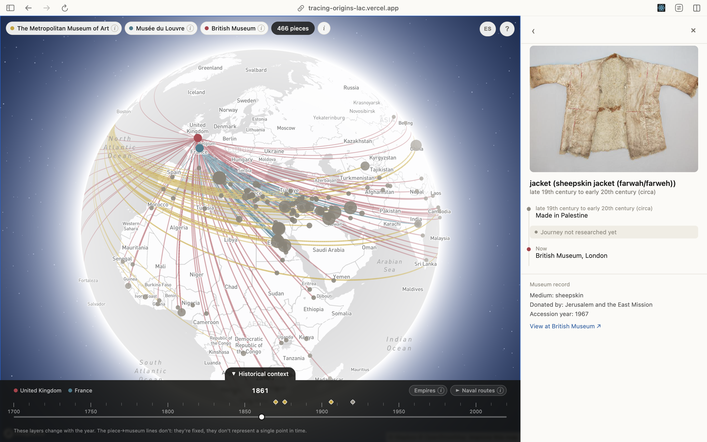

# 🏛️ Tracing Origins



Mapa interactivo que conecta obras de museos con su lugar de origen, para visualizar patrones de expropiación y colonización en las colecciones. El foco son tres museos "de prestigio" en países que colonizaron: **The Metropolitan Museum of Art** (Nueva York), **Musée du Louvre** (París) y **British Museum** (Londres).

Es un proyecto curado para portfolio personal, no un dataset exhaustivo — no busca representar cada museo completo, sino armar un conjunto manejable y bien documentado por institución (~150-250 piezas por museo, con un subconjunto de piezas "bandera" investigadas a fondo).

## Cómo funciona

Cada pieza tiene una línea que conecta el museo con su lugar de origen inferido. Al hacer click en un punto de origen se abre un panel con las piezas de ese lugar; al entrar a una pieza se ve su timeline documentado (creación, excavación, transferencias, adquisición) cuando existe investigación cargada.

El modelo de datos separa explícitamente tres cosas: lo que dice el museo (metadata original), lo que interpretamos nosotros geográficamente (origen inferido), y lo que investigamos nosotros históricamente (timeline de eventos, citado). Ver `CLAUDE.md` para el detalle completo de arquitectura y metodología por museo.

## Uso — pipeline de datos

```bash
pip install -r requirements.txt

python src/fetch_met.py --department 10
python src/fetch_louvre.py --per-department 60
python src/fetch_bm.py

python src/build_dataset.py && python src/build_dataset_louvre.py && python src/build_dataset_bm.py
python src/build_geography.py && python src/build_geography_louvre.py && python src/build_geography_bm.py

python src/export_web_data.py   # junta todo -> web/src/data/objects.json
```

## Uso — app web

Vite + React + TypeScript + Mapbox GL (globo 3D). Requiere `web/.env` con `VITE_MAPBOX_TOKEN` y haber corrido `export_web_data.py` al menos una vez.

```bash
cd web
npm install
npm run dev      # servidor local con hot reload
npm run build    # build de producción en web/dist
```

## Estado

- [x] The Met: pipeline completo, 161 piezas geocodificadas (6 departamentos prioritarios)
- [x] Louvre: pipeline completo, 239 piezas (215 geocodificadas) vía puente Wikidata — dentro de la meta ~150-250
- [x] British Museum: scraper propio, 90 piezas curadas a mano en distintas regiones del mundo, 100% geocodificadas (quinta ronda 17/08 sumó 26: Irán, Afganistán, Tíbet, Sierra Leona, Uganda, Zimbabue, Palestina, Malaui, Guatemala, Perú, Botsuana, Zambia, Trinidad/Guyana, Camboya y Java; sexta ronda 17/08 sumó 8: Ecuador, Bolivia, Venezuela, Brasil, Marruecos, Vietnam, Nepal y Tonga; séptima ronda 17/08 sumó 6: Chile, Senegal, Malí, Tailandia, Mongolia y Madagascar)
- [x] 466 piezas totales en el mapa (Met 161 + Louvre 215 + BM 90)
- [x] Modelo de 3 capas (metadata / geografía / investigación histórica)
- [x] App web con globo interactivo (Mapbox GL), panel lateral con timeline por pieza
- [x] Toggles por museo con contador de piezas visibles
- [x] Capa de contexto: territorios coloniales de UK/Francia, timeline interactivo 1700-2020 (Cliopatria, CC-BY 4.0), opcional vía toggle con leyenda
- [x] Capa de contexto: rutas navales UK/Francia 1700-1900 (CLIWOC/PANGAEA, CC-BY 3.0, 50 rutas curadas), conectada al mismo timeline que los territorios coloniales, toggle independiente ("Imperios"/"Rutas navales")
- [x] Hitos puntuales en el timeline (círculo + tooltip on hover) — 3 eventos institucionales del Met (1870 fundación, 1876 Colección Cesnola, 1906 arranca la Expedición Egipcia propia), extensible a BM/Louvre
- [x] Piloto de investigación profunda: 5 piezas egipcias del Met con fuentes citadas
- [x] Investigación profunda (layer 3) en el Louvre: 10 piezas con timeline citado (mecanismos documentados: partage bajo Mandato Francés y bajo autorización otomana, venta Borghese-Napoleón, excavación privada, mercado de arte, extracción con autorización otomana + venta real, monopolio de excavación exclusivo Francia-Persia) — meta 5-10 por museo cumplida, ronda extra 17/08 sumó Zodiaque de Dendéra y Stèle de Naram-Sin
- [x] Investigación profunda (layer 3) en el British Museum: 8 piezas con timeline citado (Roseta bajo Tratado de Alejandría 1801, Placas de Benín tras la Expedición Punitiva de 1897, excavaciones en Mesopotamia otomana financiadas por el museo, pieza de Amaravati vía India Museum, y casos de contraste sin mecanismo colonial documentado) — meta 5-10 por museo cumplida
- [ ] Ampliar BM a ~150-250 piezas (hoy 90 de ~150-250 — siete rondas de curación ya bajadas, geocodificadas y en el mapa; faltan más rondas)
- [x] Nota por museo en la UI (botón "i" junto a cada toggle) explicando la lógica de extracción particular de cada uno
- [x] Nota por capa de contexto en la UI (botón "i" en "Imperios"/"Rutas navales" del timeline) — explica qué muestra y qué no cada capa
- [x] Traducción al español de los `origin_label` que ve el usuario en la ficha de cada pieza (`ES_NAMES`/`es_label()` en `geocode.py`) — antes Louvre/BM mostraban el texto crudo scrapeado (findspot en inglés con prefijos tipo "Excavated/Findspot:", o texto libre francés sin resolver); ahora las tres fuentes muestran el sitio/país ya matcheado y, cuando hay exónimo cargado, en español
- [x] Modal de información/instrucciones del proyecto (nivel 1 de "notas de contexto en la UI", ver `CLAUDE.md`) — auto-abre en la primera visita (localStorage), después accesible vía botón "?" persistente; welcome + cómo usar + modelo de 3 capas + fe de datos, sin reemplazar el popover chico "Muestra curada" que ya existía
- [ ] Cruce con Wikidata para piezas en disputa / con historial de expropiación documentado
- [ ] Decidir tratamiento narrativo una vez haya más `context_flags` cargadas (¿resaltar piezas en el mapa? ¿filtro por tipo de evento?)
- [x] Basemap y fronteras políticas — evaluado el 17/08, sin acción por ahora: `light-v11` no soporta el toggle de worldview de Mapbox (solo el estilo "Standard", cambio visual grande no justificado); Cisjordania/Gaza ya usan la convención neutral estándar (mismo tratamiento que Google/Apple Maps); Kurdistán no aparece rotulado (no es un error, no es una entidad política para Mapbox). El hallazgo real: el basemap no distingue visualmente fronteras en disputa de administrativas comunes — pendiente evaluar una nota de transparencia chica al respecto (ver detalle en CLAUDE.md)
- [ ] Evaluar Musée du Quai Branly como 4ta fuente — el Louvre no tiene departamento de África Subsahariana/América (fondo transferido a Quai Branly en 2006), así que no puede cubrir el ángulo Francia↔África/Caribe
- [x] Toggle de idioma ES/EN en la UI (botón junto al "?" de bienvenida) — primera vuelta, solo texto de interfaz nuestro (botones, notas, modal, disclaimers, panel lateral); la metadata cruda de cada pieza sigue tal cual la da cada museo (inglés Met/BM, francés Louvre) y `originLabel` sigue solo en español, sin importar el toggle
- [x] Toggle ES/EN ampliado a layer 3 y a `originLabel` (17/08, segunda vuelta): las 21 piezas bandera (Met 5, Louvre 8, BM 8) tienen ahora `notes`/`notes_en` en `context.csv` y `description_es`/`description_en` por evento en `provenance_events.csv`, traducidos a mano; `originLabel` también tiene su par `originLabelEn` (`EN_NAMES` en `geocode.py`, mismo mecanismo que `ES_NAMES` para Met/Louvre; el BM pasó a 4-tuplas `(keyword, display_es, display_en, coords)` en `BM_SITE_COORDS`/`BM_COUNTRY_KEYWORDS` porque sus displays ya eran texto ad-hoc, no una clave de diccionario reutilizable). `ObjectDetail.tsx`/`geo.ts` eligen el campo según `lang`, con fallback al campo base si falta la traducción.
- [ ] Metadata cruda del Louvre (título/material/técnica/crédito, ~239 piezas, mayormente texto único por pieza — no alcanza con un diccionario chico como el geográfico) sigue sin traducir al inglés — evaluado el 17/08, se decidió dejarlo para una ronda aparte por el volumen, en vez de una traducción automática apurada de vocabulario técnico de catalogación
- [x] Bug de geocodificación corregido (17/08): `resolve_origin_louvre()`/`resolve_origin_bm()`/`resolve_from_culture()` matcheaban keywords contra texto libre con substring plano (`in`), sin límites de palabra — encontrado al investigar el Zodiaque de Dendéra (matcheaba "Ur" dentro de "sur", mandándolo a Irak en vez de Egipto). El mismo bug afectaba a 12 piezas del Louvre en total (7 de Luristán y 1 de Asiria matcheaban "Ur" dentro de "Luristan"/"Assyrie"; 1 de Asur, 1 de Baalbek y 1 de Atenas por substrings similares; 1 de Atenas/Capua matcheaba "Mari" dentro de "Maria") — todas ahora resuelven al lugar correcto en vez de a coordenadas equivocadas sin que se notara. Fix: matching con límites de palabra (`\b`) en `_keyword_matches()`, más las keywords que faltaban (Dendera, Asur, Baalbek, Atenas, Luristán, Asiria) agregadas a `LOUVRE_SITE_COORDS`/`LOUVRE_COUNTRY_KEYWORDS`. Ver detalle en `CLAUDE.md`.
- [ ] Test suite / linter (no configurado todavía)

Nota: la investigación profunda (layer 3) queda como una línea de trabajo abierta e indefinida para los 3 museos, no una tarea que se cierra al llegar a 5-10 piezas por museo — Met, Louvre y BM ya cumplieron la meta mínima pero pueden seguir sumando piezas bandera en cualquier momento.

## Proyectos relacionados

Referencia, no fuente de datos: [heritage-vault](https://github.com/mente123/heritage-vault) mapea objetos africanos del British Museum agrupados por país. El diferencial de este proyecto es la ruta por pieza individual y el modelo de 3 capas con investigación citada.

---

Documentación técnica más profunda (metodología de descubrimiento por museo, decisiones de scraping, arquitectura interna) en `CLAUDE.md`.
