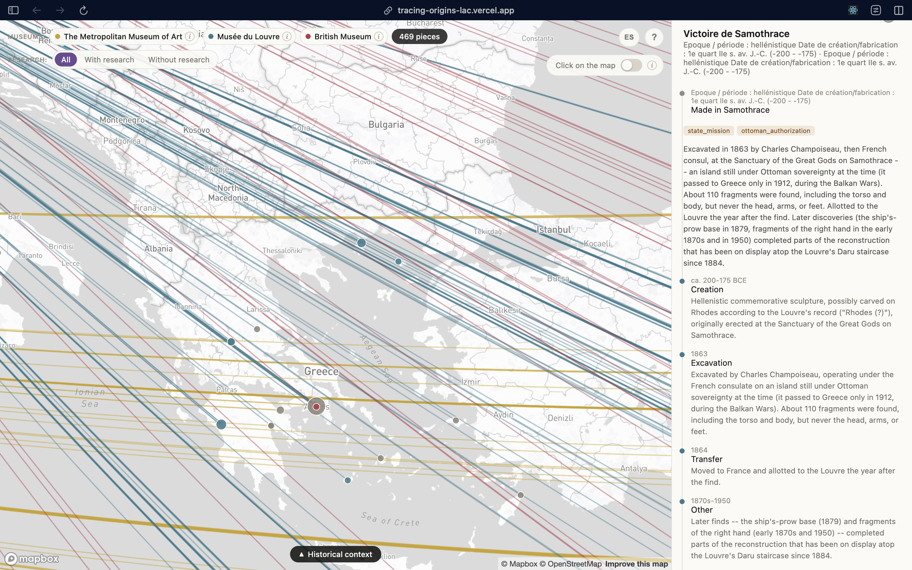
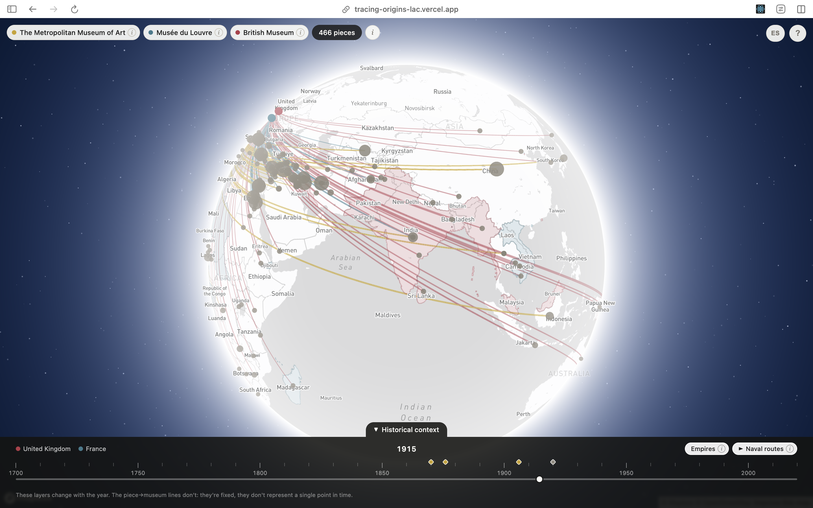
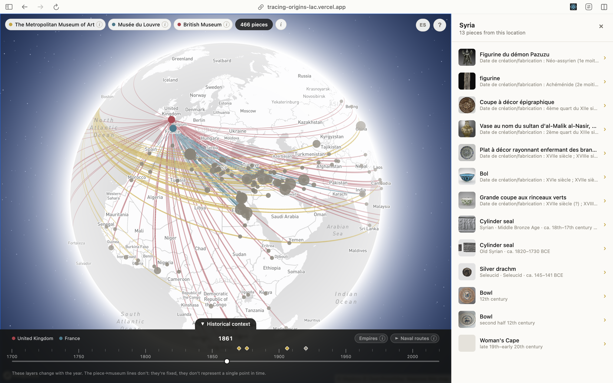

# 🏛️ Tracing Origins


_The main view: a 3D globe with lines connecting museum objects to their place of origin, a side panel with per-object detail, and a colonial-context timeline along the bottom._

**[Live demo →](https://tracing-origins-lac.vercel.app)**

Tracing Origins is an interactive map that connects museum objects to their place of origin, to visualize patterns of expropriation and colonial-era acquisition in museum collections. It focuses on three "prestige" museums in countries that were colonial powers: **The Metropolitan Museum of Art** (New York), **Musée du Louvre** (Paris), and **British Museum** (London).

Each object gets a line connecting its museum to its inferred point of origin. Clicking an origin point opens a panel listing the objects from that place; opening an individual object shows its documented journey — creation, excavation, transfers, acquisition — whenever research has been done on that piece. A colonial-context layer overlays former British and French territories and naval trade routes on a scrubbable timeline (1700–2020), so the museum-to-origin lines can be read against the territorial control that made many of those acquisitions possible.

This is a curated personal portfolio project, not an exhaustive dataset — it doesn't aim to represent each museum's full collection, just a manageable, well-documented set per institution (~150–250 pieces per museum), with a smaller subset of "flagship" pieces researched in real depth.

## How it works

The data model keeps three things explicitly separate:

1. **What the museum says** — raw metadata exactly as published by each museum's own records (title, medium, culture, credit line, accession year).
2. **Where we place it geographically** — an inferred point of origin, computed by us from each museum's free-text findspot/culture fields (see `geocode.py`), kept separate from museum metadata because it's our own inference, not a museum-provided fact.
3. **What we've researched historically** — a hand-researched, cited timeline of an object's journey (creation → excavation/find → transfers → acquisition → today), for a curated subset of pieces. This layer never labels objects "stolen" or "not stolen" — the goal is to document the documented journey, not deliver a verdict.

See `CLAUDE.md` for the full architecture and per-museum methodology.

## Screenshots

The screenshot above shows the main globe view. A few more are planned to round out the picture — drop matching files into `docs/` and uncomment the lines below to add them:


_Object detail panel: a cited provenance timeline showing each documented step in the object's journey, from creation to museum acquisition._


_Colonial-context layer: former British and French territories and naval trade routes overlaid on the globe, scrubbable from 1700 to 2020._


_Cluster panel: all objects sharing the same origin point, with thumbnail, title, and culture at a glance._

## Data at a glance

- **469 objects** on the map (Met 163 · Louvre 216 · British Museum 90 — all geocoded)
- **64 flagship pieces** with a fully cited provenance timeline (Met 14 · Louvre 30 · British Museum 20), including well-known works like the Venus de Milo, the Winged Victory of Samothrace, the Mesha Stele, the Rosetta Stone, the Parthenon Sculptures, and the Benin Bronzes
- **Two optional context layers**: former British/French colonial territories (1700–2020, [Cliopatria](https://github.com/Seshat-Global-History-Databank/cliopatria), CC-BY 4.0) and curated British/French naval routes (1700–1900, [CLIWOC](https://www.pangaea.de/), CC-BY 3.0), both on a shared, scrubbable timeline
- **Bilingual interface** (Spanish/English), including the researched provenance text itself, not just UI chrome

## Tech stack

- **Data pipeline**: Python — museum-specific scrapers/API clients, a hand-built geocoding table (no bulk calls to Nominatim), and a merge step that assembles the three data layers into a single JSON bundle for the frontend
- **Web app**: Vite + React + TypeScript + Mapbox GL (the 3D globe)

## Getting started

```bash
# Setup
pip install -r requirements.txt
cd web && npm install

# Data pipeline — run in this order from the repo root
python src/fetch_met.py --department 10
python src/fetch_louvre.py --per-department 60
python src/fetch_bm.py

python src/build_dataset.py && python src/build_dataset_louvre.py && python src/build_dataset_bm.py
python src/build_geography.py && python src/build_geography_louvre.py && python src/build_geography_bm.py

python src/export_web_data.py   # merges everything -> web/src/data/objects.json
```

```bash
# Web app — the primary experience
cd web
npm install
npm run dev      # local dev server with hot reload
npm run build    # production build in web/dist
```

The web app needs `web/.env` with a `VITE_MAPBOX_TOKEN`, and `objects.json` needs to exist before `npm run dev` will show any data.

## Project status

The core experience is complete: all three museums are pipelined and geocoded, the 3-layer data model is in place end to end, and the app has the interactive globe, per-museum toggles, bilingual UI, and both context layers. Deep research (layer 3) has passed its original 5–10-per-museum goal for all three museums and stays open-ended — new flagship pieces get added whenever a well-documented candidate turns up, regardless of the milestone already being met.

For the full, dated build log — every decision, every bug found and fixed, every open question — see `CLAUDE.md`.

## Related projects

For reference, not a data source: [heritage-vault](https://github.com/mente123/heritage-vault) maps African objects from the British Museum grouped by country. What sets this project apart is the per-object route and the 3-layer model with cited research behind it.

---

Deeper technical documentation (per-museum discovery methodology, scraping decisions, internal architecture, full development log) lives in `CLAUDE.md`.
