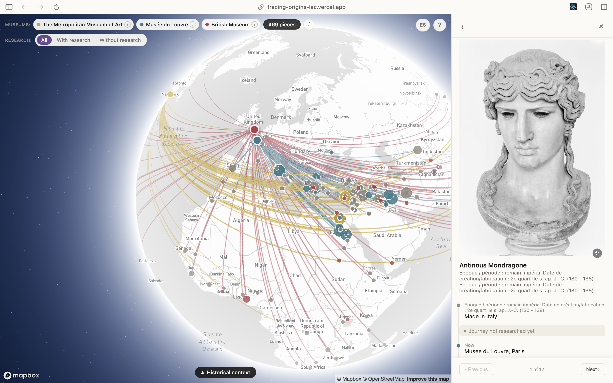
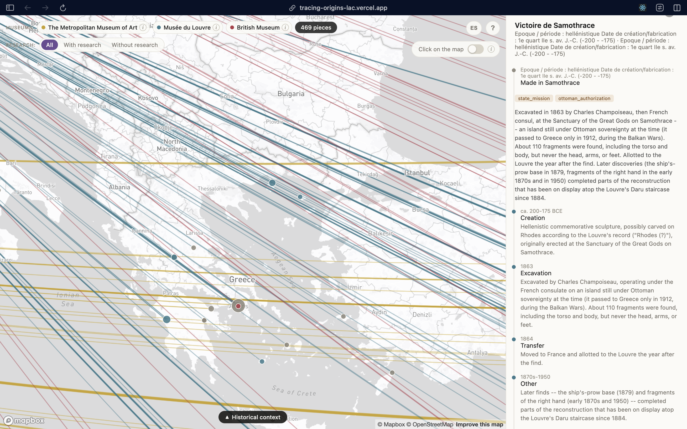
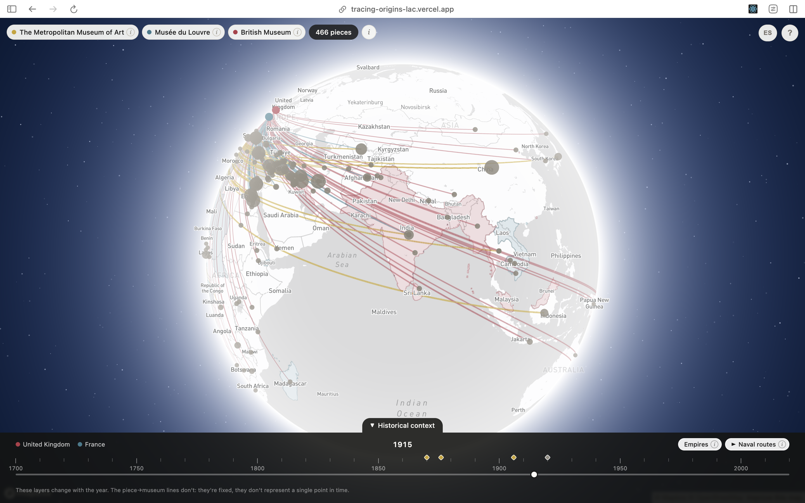
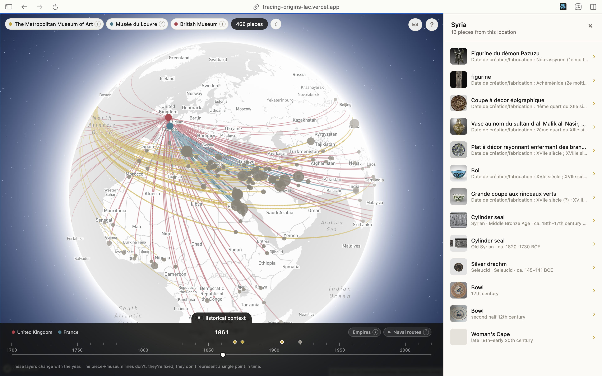
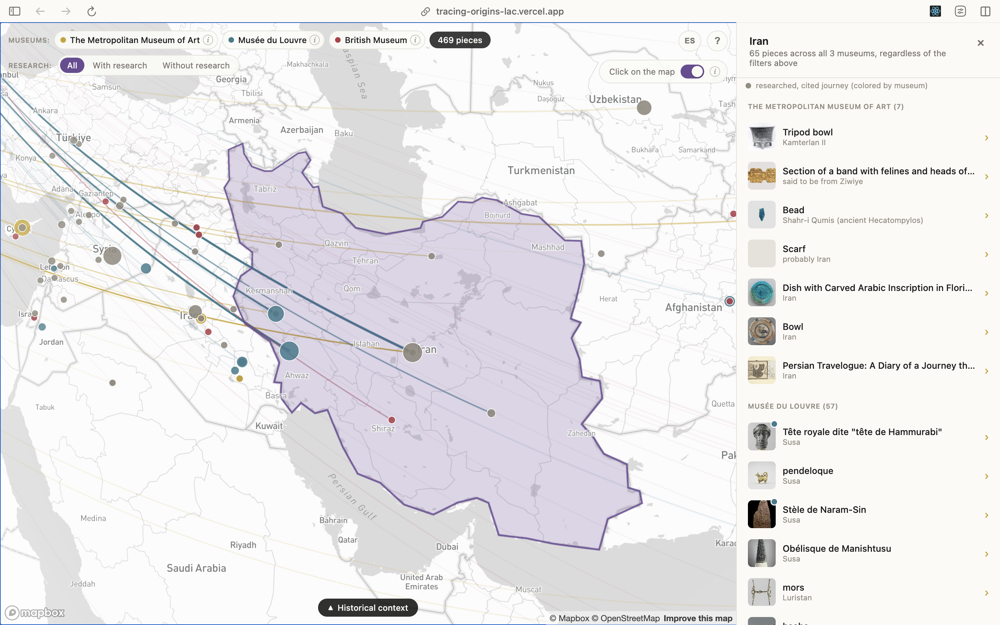

# 🏛️ Tracing Origins


_The main view: a 3D globe with lines connecting museum objects to their place of origin, a side panel with per-object detail, and a colonial-context timeline along the bottom._

**[Live demo →](https://tracing-origins-lac.vercel.app)**

Tracing Origins is an interactive map that traces museum objects back to where they actually came from, to make patterns of colonial-era acquisition visible instead of buried in a catalog entry. It focuses on four "prestige" museums in former colonial powers: **The Metropolitan Museum of Art** (New York), **Musée du Louvre** (Paris), **British Museum** (London), and **Musée du Quai Branly - Jacques Chirac** (Paris) — that last one because the Louvre's own departments skip Sub-Saharan Africa, the Americas, Asia, and Oceania almost entirely, and that's exactly where most of Quai Branly's collection comes from.

Every object gets a line from its museum to its point of origin. Click an origin point and you get every object from that place; open one object and you get its documented journey — creation, excavation, transfers, acquisition — whenever someone's actually dug into that piece's history. There's also an optional colonial-context layer: former British and French territories plus naval trade routes, scrubbable across an 1750–2020 timeline, so you can read the museum-to-origin lines against the territorial control that often made the acquisition possible in the first place.

This is a personal portfolio project, not an attempt at an exhaustive dataset. It's not trying to represent each museum's full collection — just a well-documented sample (~150–250 pieces per museum), with a smaller set of "flagship" pieces researched in real depth.

## How it works

Three things, kept deliberately apart:

1. **What the museum says** — raw metadata straight from each museum's own records: title, medium, culture, credit line, accession year.
2. **Where we think it's from** — a point of origin we infer ourselves, from each museum's free-text findspot/culture fields (see `geocode.py`). Kept separate from the museum's own metadata because it's our guess, not their fact.
3. **What we've actually researched** — a hand-researched, cited timeline of an object's journey (creation → excavation/find → transfers → acquisition → today), for a curated subset of pieces. This layer never labels anything "stolen" or "not stolen" — the goal is to document the journey, not hand down a verdict.

The full architecture and per-museum methodology lives in `CLAUDE.md`, if you want the long version.

## Screenshots

The screenshot above shows the main globe view. A few more round out the picture:


_Object detail panel: a cited provenance timeline showing each documented step in the object's journey, from creation to museum acquisition._


_Colonial-context layer: former British and French territories and naval trade routes overlaid on the globe, scrubbable from 1700 to 2020._


_Cluster panel: all objects sharing the same origin point, with thumbnail, title, and culture at a glance._


_Click any country on the globe to see its pieces grouped by museum, while every other line on the map dims to reveal just that country's origin→museum pattern._

> These screenshots are from mid/late August and are now a bit behind the actual app — see "Project status" below for what's changed since and isn't pictured yet.

## Data at a glance

- **645 objects** on the map (Met 168 · Louvre 217 · British Museum 94 · Quai Branly 166 — all geocoded)
- **260 flagship pieces** with a fully cited provenance timeline across all four museums (Met 55 · Louvre 82 · British Museum 76 · Quai Branly 47), including well-known works like the Venus de Milo, the Winged Victory of Samothrace, the Mesha Stele, the Rosetta Stone, the Parthenon Sculptures, and the Benin Bronzes
- **Two optional context layers**: former British/French colonial territories (1750–2020, [Cliopatria](https://github.com/Seshat-Global-History-Databank/cliopatria), CC-BY 4.0) and curated British/French naval routes (1754–1837, [CLIWOC](https://www.pangaea.de/), CC-BY 3.0), both on a shared, scrubbable timeline
- **Bilingual interface** (Spanish/English), including the researched provenance text itself, not just UI chrome
- A **search bar** to jump straight to a piece by title, plus filters by acquisition mechanism and by object type (sculpture, vessel, textile, etc.)

## Tech stack

- **Data pipeline**: Python — museum-specific scrapers/API clients, a hand-built geocoding table (no bulk calls to Nominatim), and a merge step that assembles the three data layers into a single JSON bundle for the frontend
- **Web app**: Vite + React + TypeScript + Mapbox GL (the 3D globe)

## Getting started

```bash
# Setup
pip install -r requirements.txt
cd web && npm install

# Data pipeline — run in this order from the repo root
python src/fetch_met.py --department 10
python src/fetch_louvre.py --per-department 60
python src/fetch_bm.py
python src/fetch_quaibranly.py --per-department 40

python src/build_dataset.py && python src/build_dataset_louvre.py && python src/build_dataset_bm.py && python src/build_dataset_quaibranly.py
python src/build_geography.py && python src/build_geography_louvre.py && python src/build_geography_bm.py && python src/build_geography_quaibranly.py

python src/export_web_data.py   # merges everything -> web/src/data/objects.json
```

```bash
# Web app — the primary experience
cd web
npm install
npm run dev      # local dev server with hot reload
npm run build    # production build in web/dist
```

The web app needs `web/.env` with a `VITE_MAPBOX_TOKEN`, and `objects.json` needs to exist before `npm run dev` will show any data.

## Project status

The core experience is done: all four museums are pipelined and geocoded, the 3-layer data model is in end to end, and the app has the interactive globe, per-museum toggles, bilingual UI, and both context layers. Deep research (layer 3) blew past its original 5–10-per-museum goal a while ago and just keeps going — new flagship pieces get added whenever a well-documented one turns up. Quai Branly was the last museum added (31/08) but has basically caught up to the others (47 pieces now), helped by its own acquisition-chain field (`ConXother`), which is more structured than what the other three museums expose.

A few things have shipped since the screenshots above were taken and aren't pictured yet: a floating search bar to jump to a piece by title, dropdown filters for acquisition mechanism and object type, a collapsible filters drawer on mobile, and a guided spotlight tour that replaces the old welcome modal on first visit. Worth a fresh round of screenshots at some point — not urgent, just flagging it.

For the full, dated build log — every decision, every bug found and fixed, every open question — see `CLAUDE.md`.

## Related projects

For reference, not a data source: [heritage-vault](https://github.com/mente123/heritage-vault) maps African objects from the British Museum grouped by country. What sets this project apart is the per-object route and the 3-layer model with cited research behind it.

---

Deeper technical documentation (per-museum discovery methodology, scraping decisions, internal architecture, full development log) lives in `CLAUDE.md`.
